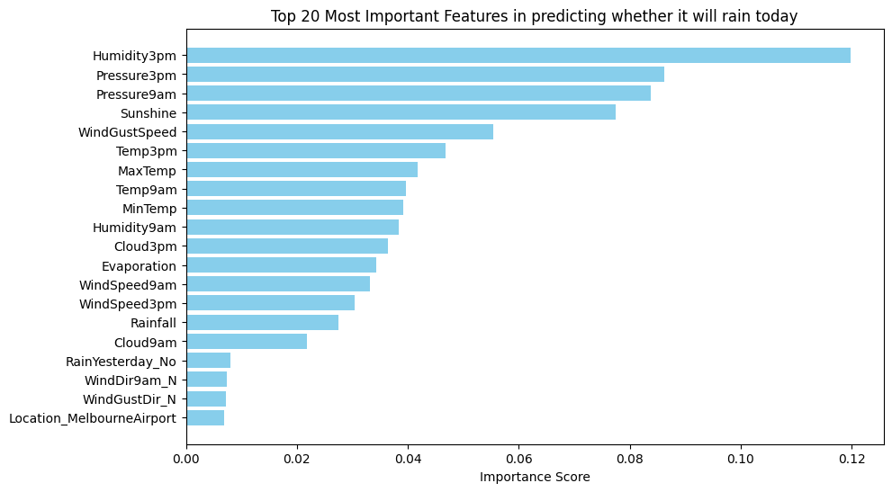
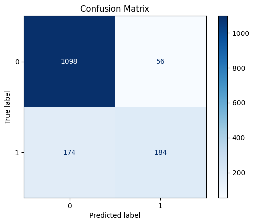

# Rainfall Prediction in Australia using Classical Machine Learning

[](https://github.com/ezedeem223/rainfall-prediction-classifier/actions/workflows/ci.yml)

This repository predicts whether it will rain the next day in Australia from tabular weather observations. The maintained runtime surface lives under `src/` and `scripts/`, while archived exploratory notebooks remain in `notebooks/` for provenance. Together they provide a reproducible, testable Python project without hiding the earlier notebook-led development history.

## Quick Start

```bash
make setup
make train
make evaluate
```

Place the dataset at `data/raw/weatherAUS.csv` before running `make train` or `make evaluate`.

## Why This Project Matters

This project shows how to turn an exploratory tabular machine learning workflow into a maintainable Python repository. The installable package, config-driven scripts, lightweight tests, and preserved artifacts make the project reproducible without pretending the archived notebooks are the canonical runtime entrypoint.

## Key Features

- Installable Python package under `src/rainfall_prediction`
- Classical tabular classification for Australian weather data
- Comparison of Logistic Regression, Random Forest, and XGBoost
- Reusable preprocessing pipeline with categorical encoding and numerical scaling
- Config-driven train, evaluate, and predict scripts
- Saved model artifact workflow for later inference
- Archived exploratory notebooks retained separately for provenance

## Architecture Diagram


## Project Structure

```text
rainfall-prediction-classifier/
|-- .env.example
|-- .gitattributes
|-- .github/
|   `-- workflows/
|       `-- ci.yml
|-- .gitignore
|-- CITATION.cff
|-- LICENSE
|-- Makefile
|-- README.md
|-- configs/
|   |-- data.yaml
|   |-- inference.yaml
|   `-- train.yaml
|-- data/
|   |-- README.md
|   `-- raw/
|       `-- .gitkeep
|-- models/
|   |-- .gitkeep
|   `-- README.md
|-- notebooks/
|   |-- README.md
|   |-- exploration.ipynb
|   `-- rainfall_prediction_classifier.ipynb
|-- pyproject.toml
|-- requirements-dev.txt
|-- requirements.txt
|-- results/
|   |-- README.md
|   |-- classification_report.txt
|   |-- confusion_matrix.png
|   |-- feature_importance.png
|   |-- logistic_regression_confusion_matrix.png
|   |-- metrics.json
|   |-- model_comparison.csv
|   `-- sample_predictions/
|       |-- README.md
|       `-- example_input.json
|-- scripts/
|   |-- run_evaluate.py
|   |-- run_predict.py
|   `-- run_train.py
|-- src/
|   `-- rainfall_prediction/
|       |-- __init__.py
|       |-- config.py
|       |-- data.py
|       |-- evaluate.py
|       |-- features.py
|       |-- pipeline.py
|       |-- predict.py
|       |-- train.py
|       |-- utils.py
|       `-- visualization.py
`-- tests/
    |-- test_config.py
    |-- test_pipeline.py
    `-- test_predict.py
```

## Dataset

- Source: [Kaggle weather dataset](https://www.kaggle.com/datasets/jsphyg/weather-dataset-rattle-package)
- Expected local CSV: `data/raw/weatherAUS.csv`
- Current package target column: `RainTomorrow`
- The raw dataset is not committed to the repository

Place the CSV at:

```text
data/raw/weatherAUS.csv
```

An earlier development notebook references a legacy CSV mirror named `weatherAUS-2.csv`. The current scripts expect a local Kaggle CSV for reproducibility.

## Methodology

The current package keeps the established modeling direction and preprocessing style:

1. Load tabular weather data.
2. Drop rows with missing values.
3. Derive a seasonal feature from `Date`.
4. One-hot encode categorical columns.
5. Scale numerical columns.
6. Split the data with a stratified train/test split.
7. Compare Logistic Regression, Random Forest, and XGBoost.

An archived development notebook also includes an exploratory variant that:

- narrows the data to Melbourne, Melbourne Airport, and Watsonia,
- renames `RainTomorrow` to `RainToday` for a same-day rainfall framing,
- exports Random Forest and Logistic Regression confusion matrices.

That notebook remains in `notebooks/rainfall_prediction_classifier.ipynb` as part of the project record, while the package defaults to the repository's public framing of predicting `RainTomorrow`.

## Results

Earlier repository reporting documented the following model comparison:

| Model | Train Accuracy | Test Accuracy |
| --- | ---: | ---: |
| Logistic Regression | 84.03% | 84.24% |
| Random Forest | 99.99% | 84.28% |
| XGBoost | 87.11% | **85.19%** |

These values are retained in `results/metrics.json` and `results/model_comparison.csv` as historical project results.

Important provenance note:

- The archived notebook and exported PNGs retain Random Forest and Logistic Regression visual outputs.
- The archived notebook does **not** contain XGBoost training cells or a structured metric table that re-verifies the XGBoost numbers from source.
- Because of that, the XGBoost row above is retained from earlier repository reporting rather than re-derived from the archived notebook.

## Why XGBoost Performed Best

On mixed tabular weather data, gradient boosting often captures non-linear thresholds and feature interactions more effectively than Logistic Regression, while generalizing better than an overfit Random Forest. That fits the historical pattern reported here: Random Forest nearly memorized the training data, while XGBoost achieved the strongest held-out accuracy.

## Sample Outputs

Preserved evaluation artifacts from earlier development runs:

Random Forest feature importance from preserved evaluation artifacts:



Random Forest confusion matrix from preserved evaluation artifacts:



Additional preserved Logistic Regression confusion matrix:

`results/logistic_regression_confusion_matrix.png`

Illustrative inference example after a trained model artifact is available:

Input:

```json
{
  "Date": "2017-06-01",
  "Location": "Melbourne",
  "MinTemp": 9.3,
  "MaxTemp": 15.2,
  "Humidity3pm": 71,
  "Pressure3pm": 1012.8,
  "RainToday": "Yes"
}
```

Output:

```text
RainTomorrow: Yes
```

The exact label depends on the trained model artifact and local dataset. Any real inference payload must match the feature columns expected by the saved artifact.

## Installation

```bash
python -m venv .venv
# Windows PowerShell
.venv\Scripts\Activate.ps1

python -m pip install --upgrade pip
python -m pip install -r requirements.txt
python -m pip install -r requirements-dev.txt
python -m pip install -e .
```

## Usage

Train all configured models and save the selected artifact:

```bash
python scripts/run_train.py --config configs/train.yaml
```

Evaluate the saved model and write structured outputs under `results/`:

```bash
python scripts/run_evaluate.py --config configs/inference.yaml
```

Run inference on the example payload:

```bash
python scripts/run_predict.py --config configs/inference.yaml --input results/sample_predictions/example_input.json
```

Minimal Python usage is also available once you have a trained artifact and an input payload that matches the saved model's expected feature columns:

```python
from rainfall_prediction.config import load_config
from rainfall_prediction.predict import (
    load_model_artifact,
    load_prediction_input,
    predict_from_frame,
)

config = load_config("configs/inference.yaml")
artifact = load_model_artifact(config["paths"]["model_path"])
frame = load_prediction_input("path/to/matching_input.json")
predictions = predict_from_frame(artifact, frame)
print(predictions.head())
```

You can also use the `Makefile` shortcuts:

```bash
make setup
make install-dev
make test
make train
make evaluate
make predict
```

## Notebooks

- `notebooks/README.md`: provenance note for the archived notebook material and the maintained runtime surface
- `notebooks/rainfall_prediction_classifier.ipynb`: archived exploratory notebook from an earlier development stage
- `notebooks/exploration.ipynb`: lightweight notebook that imports the package modules for quick inspection

## Limitations

- The dataset is not committed, so training and evaluation require a local CSV checkout.
- The archived notebook and the public project framing do not line up perfectly: the notebook contains a Melbourne-area same-day rainfall variant, while the repository is framed around Australia-wide `RainTomorrow` prediction.
- No trained model artifact is committed by default.
- The committed results files are partly seeded from earlier repository outputs until you rerun the scripts locally.

## Future Work

- Add stronger feature engineering beyond the season feature
- Use temporal validation instead of a purely random split
- Tune XGBoost and Random Forest more systematically
- Add probability calibration
- Package a lightweight API or dashboard around the saved model artifact

## License

This repository is released under the [MIT License](LICENSE). Citation metadata is provided in [CITATION.cff](CITATION.cff).
